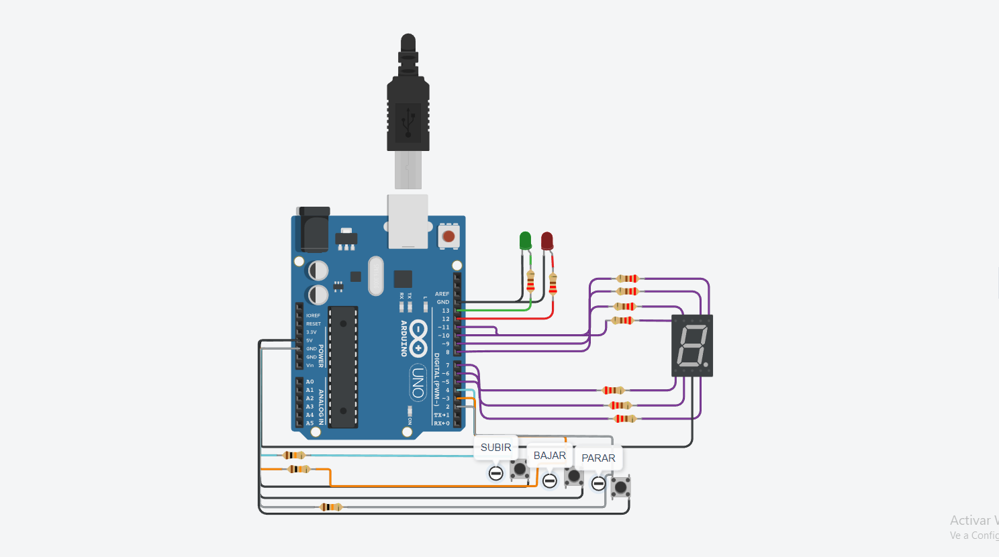
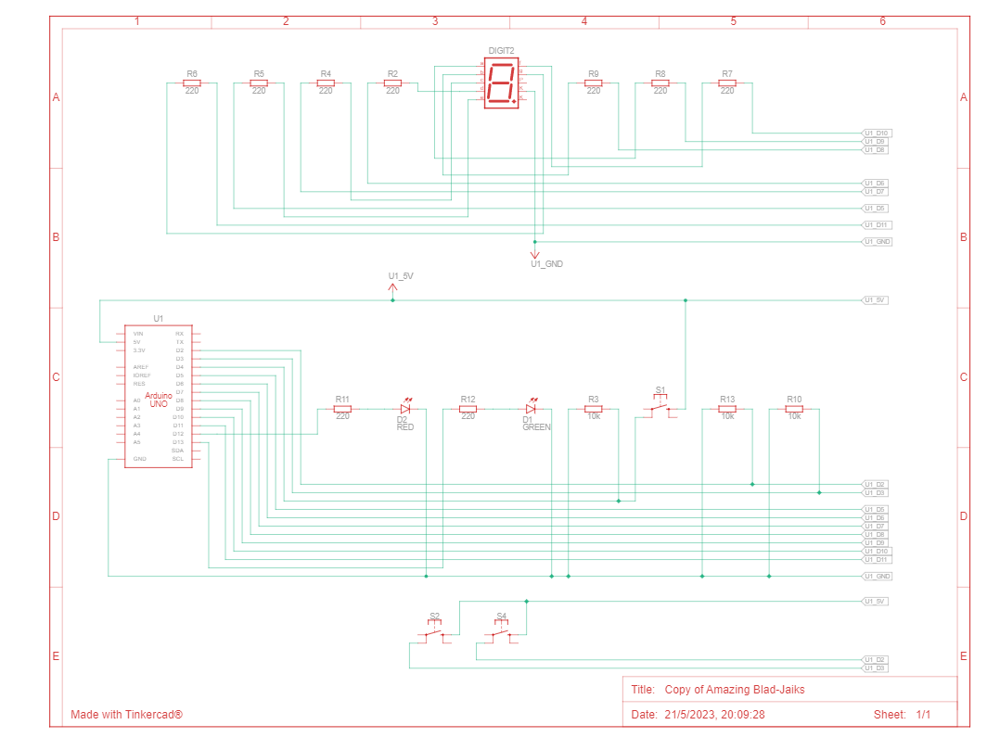

## Integrantes 
- Thiago Rodriguez

## Proyecto: Montacarga.

## Diagrama Esquematico

## Descripción
1) Interfaz de usuario:  
• Deberá haber 3 botones, uno para subir pisos, otro para
bajar pisos y otro para
detener el montacarga.  
• Deberá tener 2 LEDs, uno verde que indicará cuando el
montacarga este en
movimiento, otro rojo que indique cuando el montacarga 
esté pausado.  
• En el display 7 segmentos deberán informar en tiempo 
real en qué piso se
encuentra el elevador.  
• Se sabe que el tiempo de trayecto entre pisos es de 3 
segundos (3000 ms).   
•Se deberá informar por monitor serial el piso en el que 
se encuentra el montacarga, este en funcionamiento o en pausa.  
2) Funcionamiento del montacarga:  
• Implementa un algoritmo que permita que el elevador suba 
y baje o frene presionando los botones correspondientes.  
• Deberán buscar una forma para pausar el montacargas 
cuando el usuario lo determine.    
3) Documentación:  
• Deberán presentar un diagrama esquemático del circuito
y explicar el funcionamiento aplicado de cada componente.  
• Presentar el código fuente del proyecto de Arduino  listo para ser implementado.  
• Deberán explicar el funcionamiento integral utilizando documentación MarkDown.  

## Función principal
creee variables 3 para cada boton: 
•subir: sube el ascensor. 
•bajar: baja el ascensor.
•parar: para el ascensor.   

~~~ C (lenguaje en el que esta escrito)
//variables 
#define boton_subir 4
#define boton_bajar 3
#define boton_parar 2

#define led_verde 13
#define led_rojo 12

#define LED_G 11
#define LED_F 10
#define LED_A 9
#define LED_B 8
#define LED_E 5
#define LED_D 6
#define LED_C 7
int piso = 0;
bool elevador_subiendo = false;
bool elevador_bajando = false;
int subir;
int bajar;
int parar;

void setup() 
{
  pinMode(boton_subir, INPUT);
  pinMode(boton_bajar, INPUT);
  pinMode(boton_parar, INPUT);
  
  pinMode(led_rojo, OUTPUT);
  pinMode(led_verde, OUTPUT);
  
  pinMode(LED_G, OUTPUT);
  pinMode(LED_F, OUTPUT);
  pinMode(LED_A, OUTPUT);
  pinMode(LED_B, OUTPUT);
  pinMode(LED_E, OUTPUT);
  pinMode(LED_D, OUTPUT);
  pinMode(LED_C, OUTPUT);
  
  Serial.begin(9600);
}

void loop() 
{
  
  bajar = digitalRead(boton_bajar);
  parar = digitalRead(boton_parar);
  subir = digitalRead(boton_subir);
  if(subir == HIGH || elevador_subiendo == true)
  {
    	subir_piso();   	
  }
  
  if(bajar == HIGH || elevador_bajando == true)
  {
     	bajar_piso();
  }
  
  if(parar == HIGH)
  {
      	parar_piso();
  }
  mostrar_piso();
}

//ascensor suba
void subir_piso() 
{	
    if(piso < 9)
  	{
      	prender_led_verde();
      	piso++;
        Serial.println("el ascensor esta subiendo");
      	elevador_subiendo = true;
  	}
    else
    {
       	elevador_subiendo = false;
      	prender_led_rojo();	
    }
}

//ascensor baje
void bajar_piso() 
{
  	if(piso > 0)
  	{
       prender_led_verde();
       piso--;
       Serial.println("el ascensor esta bajando");
       elevador_bajando = true;
    }
  	else
  	{
        elevador_bajando = false;
      	prender_led_rojo();	
    }
}

//ascensor parar
void parar_piso()
{
	prender_led_rojo();
  	Serial.println("el ascensor se detuvo");
   	elevador_bajando = false;
  	elevador_subiendo = false;
  	
}

void prender_led_verde()
{	
  	delay(3000);
  	digitalWrite(led_verde, HIGH);
    digitalWrite(led_rojo, LOW);
}

void prender_led_rojo()
{
  	delay(3000);
  	digitalWrite(led_verde, LOW);
    digitalWrite(led_rojo, HIGH);
}  

//numero de piso
void mostrar_piso() 
{
  switch(piso) 
  {
    case 0:
      digitalWrite(LED_A, HIGH);
      digitalWrite(LED_B, HIGH);
      digitalWrite(LED_F, HIGH);
      digitalWrite(LED_E, HIGH);
      digitalWrite(LED_D, HIGH);
      digitalWrite(LED_C, HIGH);
    break;
    case 1:
      digitalWrite(LED_B, HIGH);
      digitalWrite(LED_C, HIGH);
    break;
    case 2:
      digitalWrite(LED_A, HIGH);
      digitalWrite(LED_B, HIGH);
      digitalWrite(LED_G,HIGH);
      digitalWrite(LED_E, HIGH);
      digitalWrite(LED_D, HIGH);
    break;
    case 3:
      digitalWrite(LED_A, HIGH);
      digitalWrite(LED_B, HIGH);
      digitalWrite(LED_G,HIGH);
      digitalWrite(LED_C, HIGH);
      digitalWrite(LED_D, HIGH);
    break;
    case 4:
      digitalWrite(LED_F, HIGH);
      digitalWrite(LED_G, HIGH);
      digitalWrite(LED_B, HIGH);
      digitalWrite(LED_C, HIGH);
    break;
    case 5:
      digitalWrite(LED_A, HIGH);
      digitalWrite(LED_F,HIGH);
      digitalWrite(LED_G,HIGH);
      digitalWrite(LED_C,HIGH);
      digitalWrite(LED_D, HIGH);
    break;
    case 6:
      digitalWrite(LED_A, HIGH);
      digitalWrite(LED_F,HIGH);
      digitalWrite(LED_G,HIGH);
      digitalWrite(LED_E,HIGH);
      digitalWrite(LED_D, HIGH);
      digitalWrite(LED_C, HIGH);
    break;
    case 7:
      digitalWrite(LED_A,HIGH);
      digitalWrite(LED_B,HIGH);
      digitalWrite(LED_C,HIGH);
    break;
    case 8:
      digitalWrite(LED_A, HIGH);
      digitalWrite(LED_B, HIGH);
      digitalWrite(LED_G, HIGH);
      digitalWrite(LED_F, HIGH);
      digitalWrite(LED_E, HIGH);
      digitalWrite(LED_D, HIGH);
      digitalWrite(LED_C,HIGH);
    break;
    case 9:
      digitalWrite(LED_A, HIGH);
      digitalWrite(LED_F, HIGH);
      digitalWrite(LED_B, HIGH);
      digitalWrite(LED_G, HIGH);
      digitalWrite(LED_C, HIGH);
    break;
  }
  Serial.println(piso);
  delay(3000);
  // Apagar todos los LEDs
  digitalWrite(LED_A, LOW);
  digitalWrite(LED_B, LOW);
  digitalWrite(LED_C, LOW);
  digitalWrite(LED_D, LOW);
  digitalWrite(LED_E, LOW);
  digitalWrite(LED_F, LOW);
  digitalWrite(LED_G, LOW);
}

## :robot: Link al proyecto
- [proyecto](https://www.tinkercad.com/things/3e9PNpdPJ82-copy-of-amazing-blad-jaiks/editel?sharecode=imm2AIrrWHDZrNXbraebNIN6U8wiJ7V4xP6NbyuvOXw)

---
### Fuentes
- [Consejos para documentar](https://www.sohamkamani.com/how-to-write-good-documentation/#architecture-documentation).

- [Lenguaje Markdown](https://markdown.es/sintaxis-markdown/#linkauto).

- [Markdown Cheatsheet](https://github.com/adam-p/markdown-here/wiki/Markdown-Cheatsheet).

